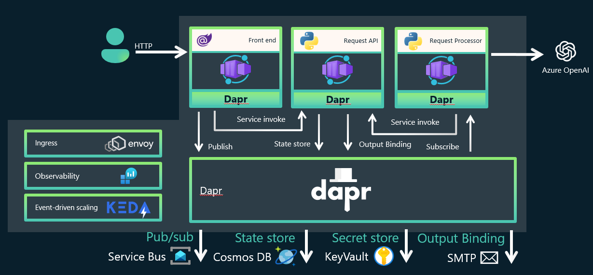

# Summarizer using Azure Open AI

Hands-on-guide : [https://aka.ms/aca-dapr-workshop](https://aka.ms/aca-dapr-workshop)

Welcome to this **Dapr, Azure Container Apps Workshop**. You'll be experimenting with Azure Serverless services in multiple labs to achieve a real world scenario. Don't worry, even if the challenges will increase in difficulty, this is a step by step lab, you will be guided through the whole process.

During this workshop you will have the instructions to complete each steps. It is recommended to search for the answers in provided resources and links before looking at the solutions placed under the 'Toggle solution' panel.

## Prerequisites

Before starting this workshop, be sure you have:

- An existing subscription with owner rights with rights to provision Azure Open AI resources.
  - If you don't have an Azure subscription, create a [free account](https://azure.microsoft.com/en-us/free/) before you begin.
  - You can request access to Azure Open AI [here](https://aka.ms/oai/access)
- Azure providers should be registerd on your Azure Subscription if not done yet: `Microsoft.CognitiveServices`, `Microsoft.DocumentDB`, `Microsoft.ContainerRegistry`, `Microsoft.KeyVault`, `Microsoft.ServiceBus`,`Microsoft.Web`

## Link Summarizer

**Link Summarizer** is an application designed to demonstrates how to build a, intelligent cloud native application using Dapr, Containers Apps and Open AI. It is composed of multiple microservices.

**Summarizer Blazor App (Front-end)** : A Blazor WebAssembly application that allows to browse all summaries and eventually queue new links to be summarized.

**Requests API (Python)** : FastAPI leveraging Dapr state management to store / get all requests of summaries. It allows to track and reuse previous summaries eventually generated. When a new completed request is created following processing, it sends a email message to the requestor.

**Requests Processor (Python)** : A Python application that allows to process summary requests in queue. If no summary has already being provided, it will prompt Azure Open AI to get a new summary. In any case, requests will be tracked using the requests API at the end of the process.

## How to install

### 1. 

### 2. 
