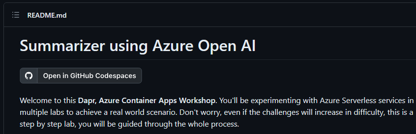
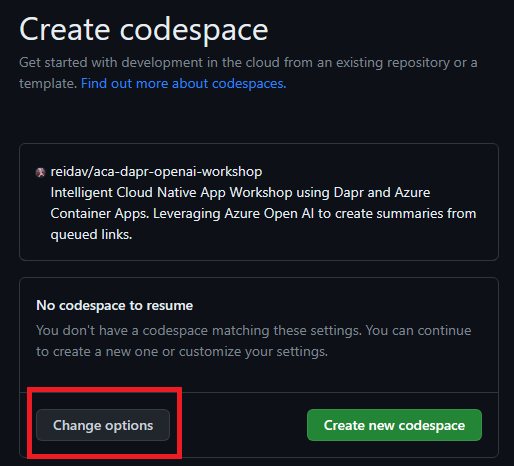
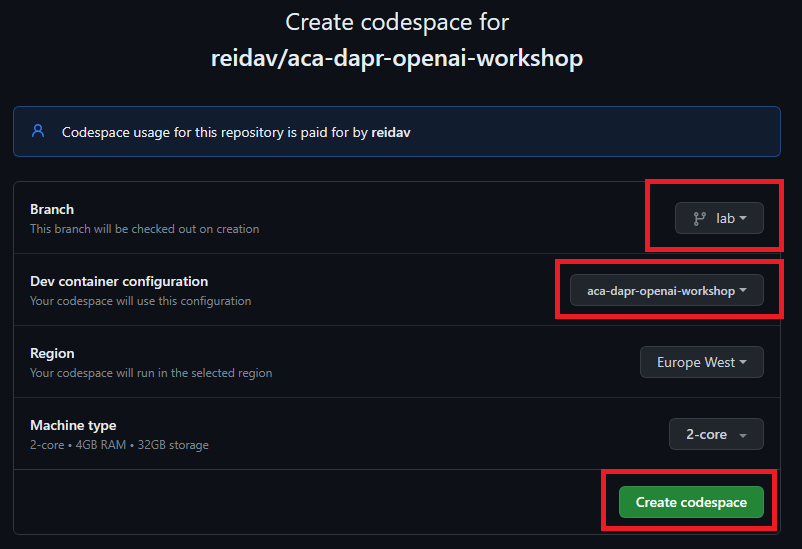
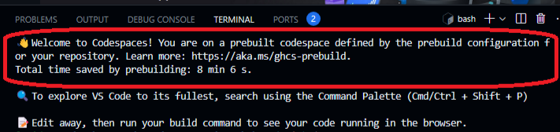
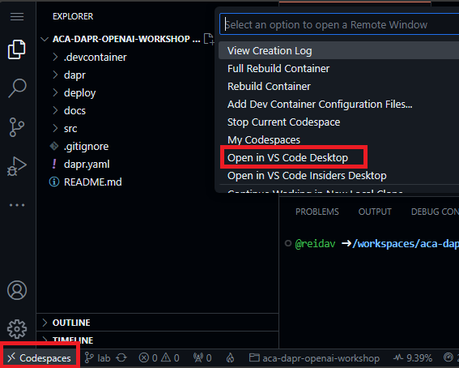

# Setup Codespace

You can run this application in a [GitHub Codespace](https://docs.github.com/en/codespaces/developing-in-codespaces/creating-a-codespace). This is useful for development and testing.

1. Open the [ACA Dapr Workshop GitHub](https://github.com/reidav/aca-dapr-openai-workshop)

2. Click the `Open in Codespaces` button

3. Click the `Change options` button

4. Select the `lab` branch, the `aca-dapr-openai-workshop` dev container configuration and click `create codespace`.

5. Wait for the Codespace to be created

> As we've been using GitHub Codespaces prebuild feature, Codespace should be ready in a few seconds. Click here to learn more [about prebuilds](https://docs.github.com/en/codespaces/prebuilding-your-codespaces/about-github-codespaces-prebuilds).

6. Once the Codespace is ready, you can start working on the dev container through the browser or you can also connect to it using Visual Studio Code 

> In case you're having the error message "Address already in use - bind", you can use the following command to free the address in use: `sudo lsof -i :8080` and then `sudo kill -9 <PID>`