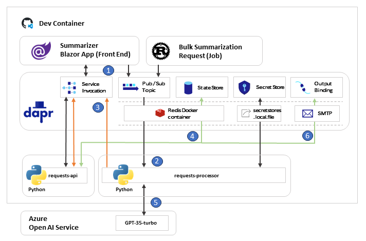

# Summarizer app using local components 

{: .no_toc }

  

    Table of contents
  

  {: .text-delta }
- TOC
{:toc}

In the following sub-section of this chapter, we will be configuring the Summarizer application with Dapr components (mostly Redis as Pub/Sub & State Store provider, local secrets and SMTP connector).

Before we start, let's have a look at the application architecture.

## Application architecture

## Application behaviors

1. User can requests summary of any links using the Blazor application (Single Page Application using the Dapr .NET SDK to interact with the Dapr Runtime).
    * User can see the previous requests from the portal (using the Dapr Service Invocation to call the Requests API)
    * User can request a new summary of a link (using the Pub/Sub building block to publish a new request to the Requests Processor)

1. The requests processor retrieves the request from the queue.

1. The requests processor is calling the requests API to evaluate if any requests already exists for this link.

1. The requests API is checking within the state store

1. If no results were provided by the request api, the request processor will resolve the summary using Azure Open AI endpoint. 
    * If a summary was provided previously, the request processor will leverage it and will not call the Azure Open AI endpoint.

1. After the request processing, a new record is created in the state store and an email is sent to the user using the SMTP connector.

> Note: Bulk Summarization Request is a once time process aimed to generate requests automatically for debug purposes at the time being. It is also using the Pub/sub building block to publish a new request to the Requests Processor.

## Source code

Spend some time to review the source code of the application located in the source code folder of the repository especially the `app.py` of backend application to understand their behaviours. 

