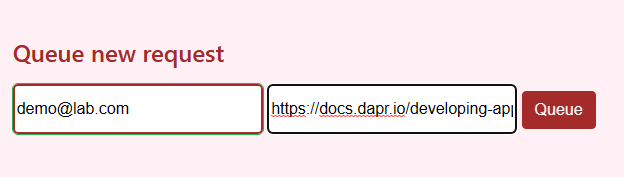
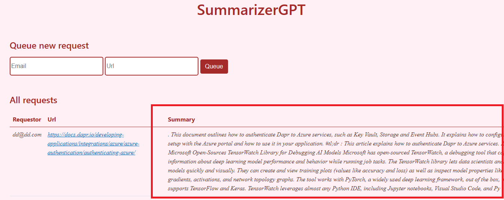
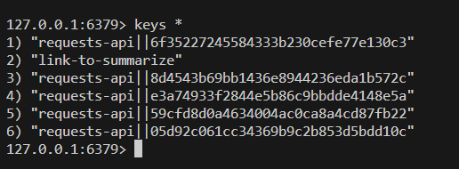

# Requests Processor

{: .no_toc }

<details open markdown="block">
  <summary>
    Table of contents
  </summary>
  {: .text-delta }
- TOC
{:toc}
</details>

## Add Request Processor to `dapr.yaml`

As we will be having many dapr applications, let's leverage the [multi-run](https://docs.dapr.io/developing-applications/local-development/multi-app-dapr-run/) feature of Dapr to run all the applications at once. So let's add Requests Processor App to the `dapr.yaml` file.

* Open the `dapr.yaml` file in the `/` folder and add a new node for the application including the environment variables.

<details markdown="block">
  <summary>
    Toggle solution
  </summary>

```yaml
- appID: summarizer-requests-processor
  appDirPath: ./src/requests-processor/
  appPort: 12000
  command: ["uvicorn", "app:app", "--host", "0.0.0.0", "--port", "12000"]
  env:
    SECRET_STORE_NAME: "summarizer-secretstore"
    PUBSUB_REQUESTS_NAME: "summarizer-pubsub"
    PUBSUB_REQUESTS_TOPIC: "link-to-summarize"
    REQUESTS_API_APP_ID: "summarizer-requests-api"
    REQUESTS_API_SEARCH_ENDPOINT: "search-requests-by-url"
    REQUESTS_API_CREATE_ENDPOINT: "requests"
    OPENAI_API_VERSION: "2022-12-01"
    OPENAI_API_DEPLOYMENT_NAME: "aca-dapr-gpt-35-turbo-01"
    APP_PORT: 12000
```
</details>

> Note: The `appID` is used to identify the application in the Dapr runtime. The `appDirPath` is the path to the application folder. The `appPort` is the port used by the application. The `command` is the command used to start the application. The `env` is the environment variables used by the application.

> Note: PubSub are already created, so we will be reusing the existing definition created before.

## Request Processor Overview

1. Open the `app.py` file in the `/src/request-processor` folder, and notice the subscribe method being used as en entry point

```python	
# Subscribe to a new request from the pub/sub component
async def link_to_summarize(event : SummarizeRequestCloudEvent):
```

2. Open the `request_handler.py` file in the `/src/request-processor` folder, and notice how the request is being processed (eventually using Azure Open AI).

## Implementing pub/sub and Http Invocation methods.

1. Open the `request_handler.py` file in the `/src/requests-processor` folder.

2.  Fill the `run` method so that it invokes the `requests-api` to search for a existing request. If the request is not found, it should invoke Open AI to get the summary. If the request is found, then it will reuse the summary from the request. In any case, it should invoke again the request api at the end to commit the new request.

<details markdown="block">
  <summary>
    Toggle solution
  </summary>

```python	
async def run(self):
    logging.debug("Trying to find existing request in state")
    request = await self.__try_find_by_url(self.event.data.url)
    if not (request):
        logging.info(
            f"Azure Open AI requests for {self.event.data.url}")
        summary = await self.__get_summary(self.event.data.url)
    else:
        logging.info(
            f"Get summary from state for {self.event.data.url}")
        summary = request["summary"]
    resp = await self.dapr_client.invoke_method_async(
        self.settings.requests_api_app_id,
        self.settings.requests_api_create_endpoint,
        json.dumps({'url': self.event.data.url, 'email': self.event.data.email, 'summary': summary}),
        http_verb="POST")
```
</details>

## Validate the overall processes

1. Execute dapr run multi run command to start the application

    ```bash
    dapr run -f .
    ``` 
2. Open the blazor application, create a new request using any email and link



3. Check that the request is stored in redis and refresh the blazor page to see the summary of the request.





## Bonus : Repeat the same dapr onboarding process with a new application (e.g, job-processor)

Job processor is sending new summary request in queue to be processed by the request processor. The request processor is then invoking the request api to store the new summary. It's a way to automate the process of sending new summary request to the request processor.

{: .no_toc }
## Congratulations !

You've been able to implement Dapr Components to an existing application to avoid strong coupling between application dependancies. In the next chapter, we will see how to use Dapr to deploy the application to Azure Container Apps.