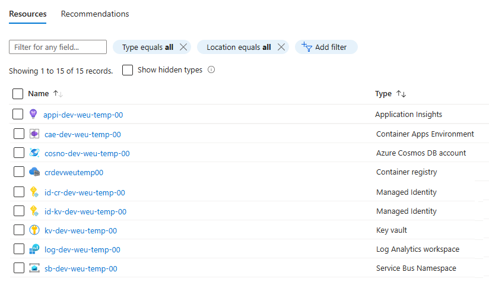

# Container Apps Environment Deployment (including Dapr Components)

{: .no_toc }

<details open markdown="block">
  <summary>
    Table of contents
  </summary>
  {: .text-delta }
- TOC
{:toc}
</details>

## General Information

In this section, we will deploy the infrastructure for the Container Apps environment. This includes the following resources:
*   Azure Container Apps Environment
*   Dapr components
*   Azure Container Registry
*   Azure Key Vault
*   Azure Service Bus
*   Managed Identities

Lucky for us, we already have bicep templates available to deploy all of these resources within the solution.
If you want to learn more about the bicep templates, you can find them in the [bicep](https://learn.microsoft.com/en-us/azure/azure-resource-manager/bicep/overview?tabs=bicep) but also in the [ACA Landing Zone Accelerator](https://github.com/Azure/aca-landing-zone-accelerator).

## Deploying the infrastructure

Within the `/deploy/containerapps` folder, you will find the following files:
*  `infra.bicep` - This is the main bicep template that will deploy all of the infrastructure resources (except for the container apps)
*  `apps.bicep` - This is the bicep template that will deploy the container apps
*  `parameters.jsonc` - This is the parameters file that will be used to deploy the infrastructure resources
    > Make sure you have created this file before deploying the infrastructure if not, based on the sample provided
* `/dapr/*.bicep` - These are the bicep templates that will deploy the Dapr components
* `run-deploy.sh` - This is the script that will deploy both the infrastructure and the apps resources

### Add dapr components to infra.bicep

* Open the `infra.bicep` file, scroll down to the dapr components section and add the following modules for each dapr components. Pay also attention to the underlying module to understand its behaviors.

* Output Binding (SMTP) : Dapr component that will send emails

<details markdown="block">
  <summary>
    Toggle solution
  </summary>

```bicep
// ------------------
// DAPR COMPONENTS
// ------------------

module daprSmtp 'modules/dapr/smtp.bicep' = {
  name: '${deployment().name}-dapr-smtp'
  params: {
    daprComponentName: 'summarizer-smtp'
    containerAppsEnvironmentName: containerAppsEnvironment.outputs.name
    smtpHost: smtpHost
    smtpPort: smtpPort
  }
}
```
</details>

* PubSub (Azure Service Bus) : Dapr component that will send messages to Azure Service Bus

<details markdown="block">
  <summary>
    Toggle solution
  </summary>

```bicep
module daprPubSub 'modules/dapr/pubsub.bicep' = {
  name: '${deployment().name}-dapr-pubsub'
  params: {
    daprComponentName: 'summarizer-pubsub'
    containerAppsEnvironmentName: containerAppsEnvironment.outputs.name
    serviceBusConnectionString: serviceBus.outputs.connectionString
  }
}
```
</details>

* State Store (Azure CosmosDb) : Dapr component that will store the state of the application 

<details markdown="block">
  <summary>
    Toggle solution
  </summary>

```bicep
module daprStateStore 'modules/dapr/statestore.bicep' = {
  name: '${deployment().name}-dapr-statestore'
  params: {
    daprComponentName: 'summarizer-statestore'
    containerAppsEnvironmentName: containerAppsEnvironment.outputs.name
    cosmosDbName: cosmos.outputs.cosmosDbName
    cosmosCollectionName: cosmos.outputs.cosmosCollectionName
    cosmosUrl: cosmos.outputs.cosmosUrl
    cosmosKey: cosmos.outputs.cosmosKey
  }
}
```
</details>

* Secret Store (Azure KeyVault) : Dapr component that will store the secrets of the application

<details markdown="block">
  <summary>
    Toggle solution
  </summary>

```bicep
module daprSecretStore 'modules/dapr/secretstore.bicep' = {
  name: '${deployment().name}-dapr-secretstore'
  params: {
    daprComponentName: 'summarizer-secretstore'
    containerAppsEnvironmentName: containerAppsEnvironment.outputs.name
    vaultName: keyVault.outputs.vaultName
    managedIdentityClientId: keyVault.outputs.vaultManagedIdentityClientId
  }
}
```
</details>

### Start the deployment

* Open a terminal and navigate to the `/deploy/containerapps` folder

* Make sure you are connected to the right subscription

```bash
az account show
```

* If you are not connected to the right subscription, run the following command

```bash
az account set --subscription <subscriptionId>
```

* Edit the deployment script './run-deploy.sh' to update the line below : 
    * export RESOURCE_GROUP=<your-resource-group-name>

* Run the deployment script
    * The overall process should take up to 4 minutes to complete

* Validate that the resources are created



* You can now move to the next section to deploy the container apps
