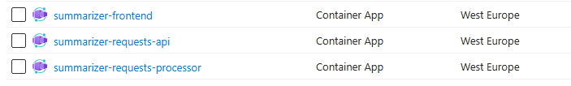
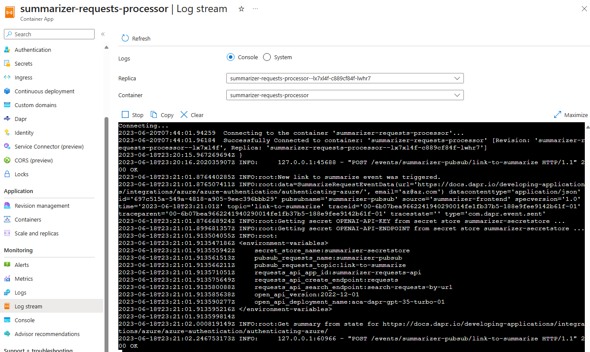

# Container Apps Deployment (Summarizer microservices)

{: .no_toc }

<details open markdown="block">
  <summary>
    Table of contents
  </summary>
  {: .text-delta }
- TOC
{:toc}
</details>

## General Information

In this section, we will deploy the Summarizer apps within the Container Apps environment. This includes the following resources:
*  Frontend Blazor App
*  Backend Requests API
*  Backend Requests Processor

In order to do so, we'll need to follow below steps :
* Execute docker build and push of all images into the container registry
* Deploy the container apps

## Adding the container app in the bicep template

* Open the `apps.bicep` file, scroll down to the container apps section and call the subsequent module defined or each container app. Pay also attention to the underlying module to understand its behaviors and map it accordingly.

* <b>Frontend Blazor App</b>

<details markdown="block">
  <summary>
    Toggle solution
  </summary>

```bicep
module frontend 'modules/apps/frontend.bicep' = {
  name: '${deployment().name}-summarizer-frontend'
  params: {
    location: location
    containerAppsEnvironmentId: containerAppsEnvironment.id
    containerRegistryUserAssignedIdentityId: containerRegistryUserAssignedIdentity.id
    keyVaultUserAssignedIdentityId: keyVaultUserAssignedIdentity.id

    containerRegistryLoginServer: containerRegistry.properties.loginServer
    containerAppName: 'summarizer-frontend'
    containerAppImage: '${containerRegistry.properties.loginServer}/summarizer/frontend:latest'
    containerAppPort: 80

    pubSubRequestsName: 'summarizer-pubsub'
    pubSubRequestsTopic:'link-to-summarize'
    requestsApiAppId:'summarizer-requests-api'
    requestsApiEndpoint: 'requests'
  }
}
```
</details>

* <b>Requests API</b>

<details markdown="block">
  <summary>
    Toggle solution
  </summary>

```bicep
module requests_api 'modules/apps/requests-api.bicep' = {
  name: '${deployment().name}-summarizer-requests-api'
  params: {
    location: location
    containerAppsEnvironmentId: containerAppsEnvironment.id
    containerRegistryUserAssignedIdentityId: containerRegistryUserAssignedIdentity.id
    keyVaultUserAssignedIdentityId: keyVaultUserAssignedIdentity.id

    containerRegistryLoginServer: containerRegistry.properties.loginServer
    containerAppName: 'summarizer-requests-api'
    containerAppImage: '${containerRegistry.properties.loginServer}/summarizer/requests-api:latest'
    containerAppPort: 80
    stateStoreName:'summarizer-statestore'
    bindingSmtp: 'summarizer-smtp'
  }
}
```
</details>

* <b>Requests Processor</b>

<details markdown="block">
  <summary>
    Toggle solution
  </summary>

```bicep
module requests_processor 'modules/apps/requests-processor.bicep' = {
  name: '${deployment().name}-summarizer-requests-processor'
  params: {
    location: location
    containerAppsEnvironmentId: containerAppsEnvironment.id
    containerRegistryUserAssignedIdentityId: containerRegistryUserAssignedIdentity.id
    keyVaultUserAssignedIdentityId: keyVaultUserAssignedIdentity.id

    containerRegistryLoginServer: containerRegistry.properties.loginServer
    containerAppName: 'summarizer-requests-processor'
    containerAppImage: '${containerRegistry.properties.loginServer}/summarizer/requests-processor:latest'
    containerAppPort: 80
    pubSubRequestsName: 'summarizer-pubsub'
    pubSubRequestsTopic:'link-to-summarize'
    openAiApiDeploymentName:'aca-dapr-gpt-35-turbo-01'
    openAiApiVersion:'2022-12-01'
    secretStoreName:'summarizer-secretstore'
    requestsApiAppId: 'summarizer-requests-api'
    requestsApiCreateEndpoint: 'requests'
    requestsApiSearchEndpoint: 'search-requests-by-url'
  }
}
```
</details>

## Deployment script

### Building / pushing the images

* Open the `run-deploy.sh` file and add docker build and docker push to the container registry for each image. :

<details markdown="block">
  <summary>
    Toggle solution
  </summary>

```bash
# echo "Retrieving Container Registry... from previous deployment"
REGISTRY=$(echo $AZ_CAENV_DEPLOYMENT | grep -oE -m 1 '/registries/([^/]+)' | tail -n +2 | cut -d'/' -f3).azurecr.io
echo "Container Registry: $REGISTRY"

# Login to Azure
echo "Logging in to Azure Container Registry..."
az acr login --name $REGISTRY

# Build and push images
echo "Building and pushing images..."
docker build -t $REGISTRY/summarizer/requests-api:latest ../../src/requests-api
docker build -t $REGISTRY/summarizer/requests-processor:latest ../../src/requests-processor
docker build -t $REGISTRY/summarizer/frontend:latest  ../../src/frontend
docker push $REGISTRY/summarizer/requests-api:latest
docker push $REGISTRY/summarizer/requests-processor:latest
docker push $REGISTRY/summarizer/frontend:latest
```
</details>

### Adding the container apps

* Right next to it, trigger the az deployment of the `apps.bicep` using the az cli command :

<details markdown="block">
  <summary>
    Toggle solution
  </summary>

```bash
# Deploy Container Apps
echo "Deploying Container Apps..."
AZ_CAENV_DEPLOYMENT=$(az deployment group create \
                        --resource-group $RESOURCE_GROUP \
                        --template-file ./apps.bicep \
                        --parameters ./parameters.jsonc)
```
</details>

* Run the script again `run-deploy.sh`, you should now be having three container apps deployed within the Container Apps environment.



## Test the application

* Open the `frontend` app in your browser, and test the application by adding a new URL to summarize. 
> You can get the FQDN of the frontend app by running the following command : `az containerapp show -n summarizer-frontend -g <resource-group-name> --query frontendEndpoint -o tsv` or using the Azure Portal in the overview section of the container app.

* Open the other containers apps logs stream to see the logs of the requests-api and requests-processor apps.



## Bonus : Make some changes to the frontend app, set revision strategy to multiple and do traffic splitting

* [Traffic splitting](https://learn.microsoft.com/en-us/azure/container-apps/traffic-splitting?pivots=azure-portal)
